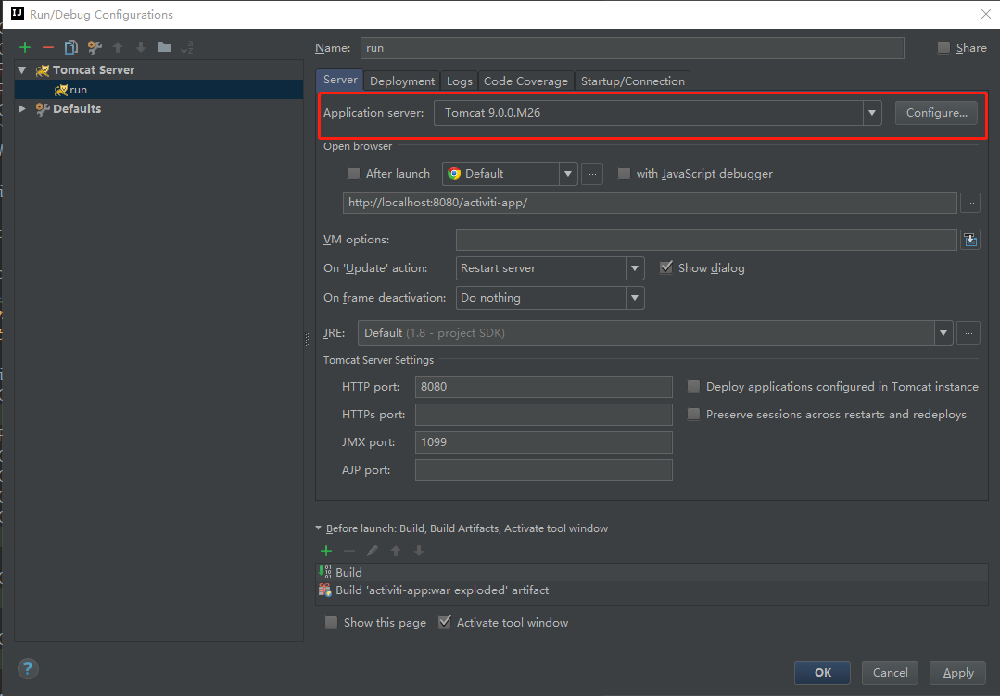
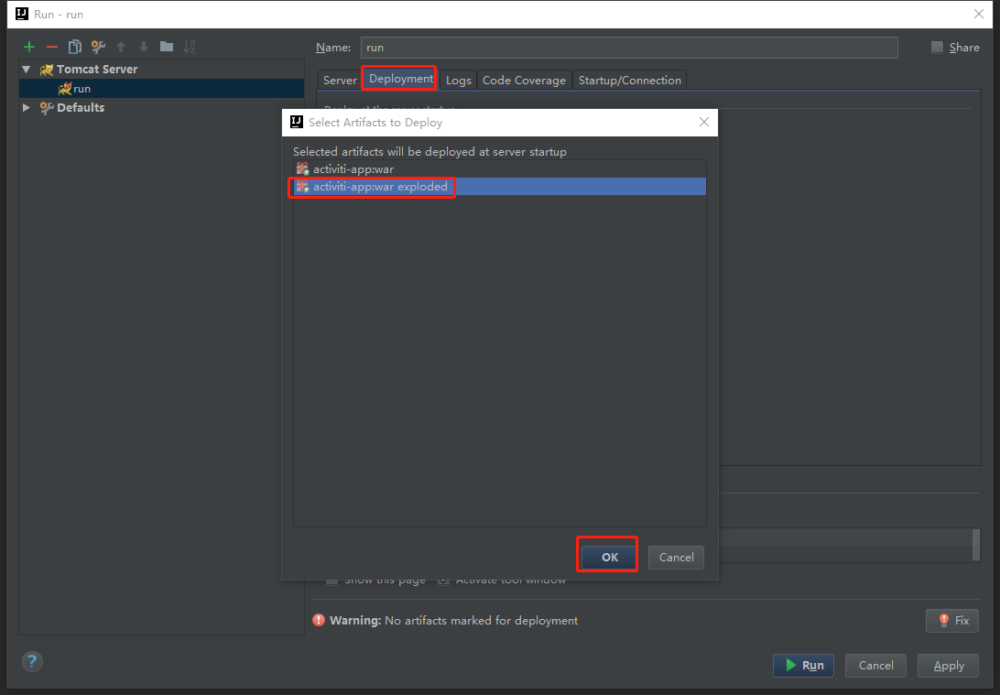
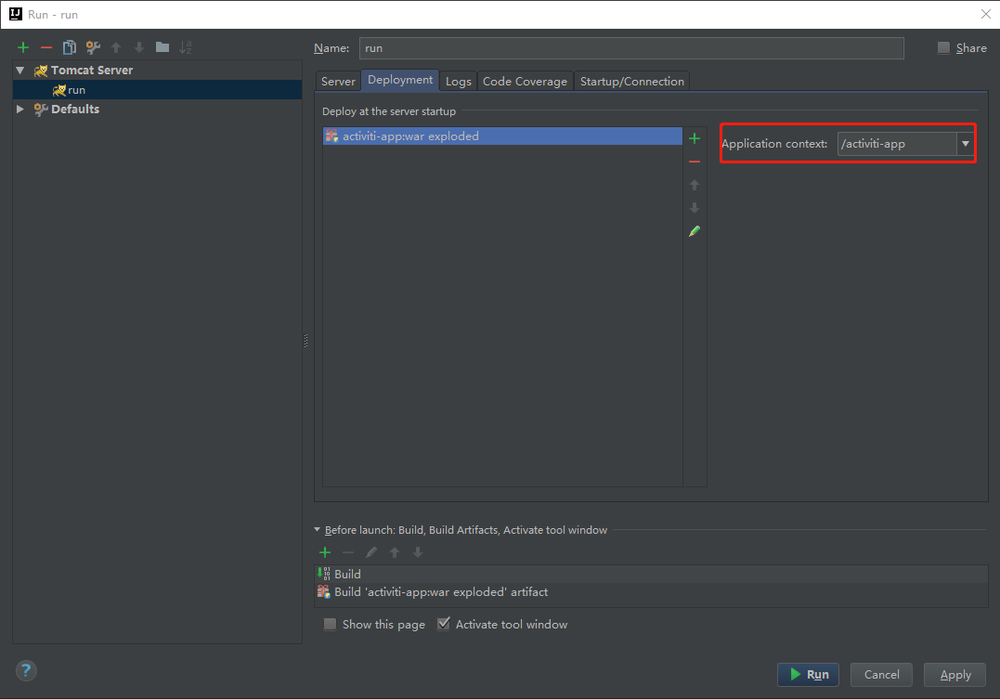

# README
## Table Of Contents
-   [Video](#video)
-   [Run in Intellij IDEA (recommend)](#run-in-intellij-idea)
-   [Run in Spring Tool Suite](#run-in-spring-tool-suite)

## Repo tree
```bash
com/zbq/                 # Implementation of global cache and message queue
├── ACTFEvent.java
├── EventType.java
├── GlobalEventQueue.java
├── GlobalVariables.java
└── VWFEvent.java

supplychain/activiti     # Closely related to the activiti engine our bussiness process execution.
├── conf                 # Java configuration files including configuring activiti engine and web context.
│   ├── ActivitiEngineConfiguration.java
│   ├── AsyncConfiguration.java
│   ├── Bootstrapper.java
│   ├── ContentStorageConfiguration.java
│   ├── CustomSecurityConfig.java
│   ├── DatabaseConfiguration.java
│   ├── EmailConfiguration.java
│   ├── JacksonConfiguration.java
│   ├── MyApplicationConfiguration.java
│   ├── MyCorsRegistration.java
│   ├── RestApiConfiguration.java
│   ├── RestTemplateConfiguration.java
│   └── SchedulingConfiguration.java
├── coord              # Impletation of 4 Coordinator Service , among them , VWC is the most complex one.
│   ├── MSCoordinator.java
│   ├── SWCoordinator.java
│   ├── VMCoordinator.java
│   └── VWCoordinator.java
├── listener           # Some of the exection/task listeners set in process model.
│   ├── AnchorStartListener.java
│   ├── DockTaskEndListener.java
│   ├── FlowIntoVoyaListener.java
│   ├── InitListener.java
│   ├── InitWeagonListener.java
│   ├── RunEndListener.java
│   ├── RunListener.java
│   ├── SendArraInfoToSWC.java
│   ├── SendMsgToVWC.java
│   ├── SendOrderToMSC.java
│   ├── VoyagingListener.java
│   └── VoyaTaskStartListener.java
├── rest
│   └── service
│       └── api       # Some convertors between custom type defined by myself and RestVariable Type build in engine.
│           ├── CustomActivitiTaskActionService.java
│           ├── CustomArrayListRestVariableConverter.java
│           ├── CustomBaseExcutionVariableResource.java
│           ├── CustomBaseVariableCollectionResource.java
│           ├── CustomDateRestVariableConverter.java
│           ├── CustomRestResponseFactory.java
│           ├── LocationRestVariableConverter.java
│           ├── VPortRestVariableConverter.java
│           ├── WeagonRestVariableConverter.java
│           └── WPortRestVariableConverter.java
├── service          # Some JavaDelegate Class bound to Service Task in process.
│   ├── CustomActivitiTaskFormService.java
│   ├── SendApplyToVMCService.java
│   ├── SendMsgToAWSService.java
│   ├── SendMsgToWVCService.java
│   ├── UpdateVesselInfoService.java
│   └── UpdateWeagonInfoService.java
└── servlet         # About other web configuration 
    ├── MyApiDispatcherServletConfiguration.java   #servlet dispatcher for url pattern /api/*
    ├── MyCorsFilter.java        # used to solve CORS problem.
    ├── MyWebConfigurer.java     # configure two servlet dispatcher , respectively for '/api/*' and '/app/*'.
    ├── SystemWebSocketHandler.java     # websocket haven't been used , you can ignore them.
    └── WebsocketHandshakeInterceptor.java

supplychain/web/        # Implementation of REST interfaces to provide endpoints to front-end or AWS to access.
├── AbstractController.java
├── CoordController.java
├── ProcessInstancesResource.java
├── TaskController.java
├── TaskFormResource.java
├── VesselController.java
└── VesselProcessInstanceVariableDataResource.java

supplychain/entity/     # Some custom Types for process model.
├── IotVessel.java
├── Location.java
├── Path.java
├── VesselVariablesResponse.java
├── VPort.java
├── Weagon.java
└── WPort.java
```


## Run in `Intellij IDEA`
1.  Download development tool:

    IDE: [Intellij IDEA](https://www.jetbrains.com/idea/download)
    
    Web Container: [Tomcat](http://tomcat.apache.org/)
    
    Database: [MYSQL](https://www.mysql.com/)

2.  Clone Source Code:

    `git clone --recursive git@github.com:sonnyhcl/Backend.git`

3.  Import Project in IDEA:  

    -   Choose `Import Project`.
        

    -   Choose the `directory path` which you clone the source code
    -   Choose import project from external model `maven`
    -   Pass `select profiles`
    -   Pass `select maven projects to import`.
    -   Carefully choose `project JDK`
    -   `Finish`
    -   Wait for IDEA to download maven dependencies

4.  Configure Mysql

    First make sure you have installed `mysql` and your mysql has a empty database called `act6`
    
    Or you can edit your own mysql `databasename/username/password` in [activiti-app.properties](https://github.com/SushantBahadure01/suppy-chain-management-system/blob/main/src/main/resources/META-INF/activiti-app/activiti-app.properties)

5.  Configure Tomcat:
    -   Click `Run`
        
    -   Edit `Run Configuration`
    -   Click the `plus` in left-up corner
    -   Choose `Tomcat Server`
    -   Choose `local`
    -   Configure tomcat in idea
        

    -   Configure artifact
        

    -   Configure application-context: `/activiti-app`
        

7.  Run Activiti

    Run Activiti and visit [https://localhost:8080/activiti-app](https://localhost:8080/activiti-app) in the browser
    ```
    username: admin
    password: test
    ```
    

8.  Import bpmn:

    After running the project and logging in  the system , upload process models under the root directory `src/main/resources`, such as `Supply_Chain_pool.bpmn`, `Weagon_Test.bpmn`, then create app for it  and publish your app, then  go to processes page to start the selected process.
    

## Run in `Spring Tool Suite`
1.  Download development tool:

    IDE: [Spring-Tool-Suite-3.9.0.RELEASE](https://spring.io/tools/sts/all)
    
    Web Container: [Tomcat](http://tomcat.apache.org/)
    
    Database: [Mysql](https://www.mysql.com/)

2.  Clone Source Code:

    `git clone --recursive git@github.com:sonnyhcl/Backend.git`

3.  Import Project:  

    To import Backend as a Maven project in IDEA, follow the steps below :
    `File -> Import -> Maven -> Existing Maven Projects -> Select Root Directory -> Finish`
   
4.  Update Maven Dependencies:

    Right click the project name `activiti-app`, then enter -> `Maven` -> `Update Project`, waiting to load dependencies.
    

5.  Configure Tomcat:

    After loading is completed, right-click the project name, followed by `Run As `-> `Run On Server` -> `choose Tomcat Server` -> `Finish`.

    

    

6.  Configure Mysql

    First make sure you have installed mysql. You can edit your own mysql `databasename/username/password` in [activiti-app.properties](https://github.com/sonnyhcl/Backend/blob/master/src/main/resources/META-INF/activiti-app/activiti-app.properties)

7.  Run Activiti

    Visit [https://localhost:8080/activiti-app](https://localhost:8080/activiti-app) in the browser, enter the login page,
    ```
    username: admin
    password: test
    ```
    

8.  Develop:

    After running the project and logging in  the system , upload process models under the root directory `src/main/resources`, such as [Supply_Chain_pool.bpmn20.xml](https://github.com/sonnyhcl/Backend/blob/master/src/main/resources/Supply_Chain_pool.bpmn20.xml), then create app for it  and publish your app, then  go to processes page to start the selected process.
    

## Dependencies
-   [`Vessel Frontend`](https://www.github.com/sonnyhcl/Frontend)
    > Attention: In order to perform as [demo](#demo) shows, The `Activiti Backend` project must be coordinated with the `Vessel Frontend` project.
